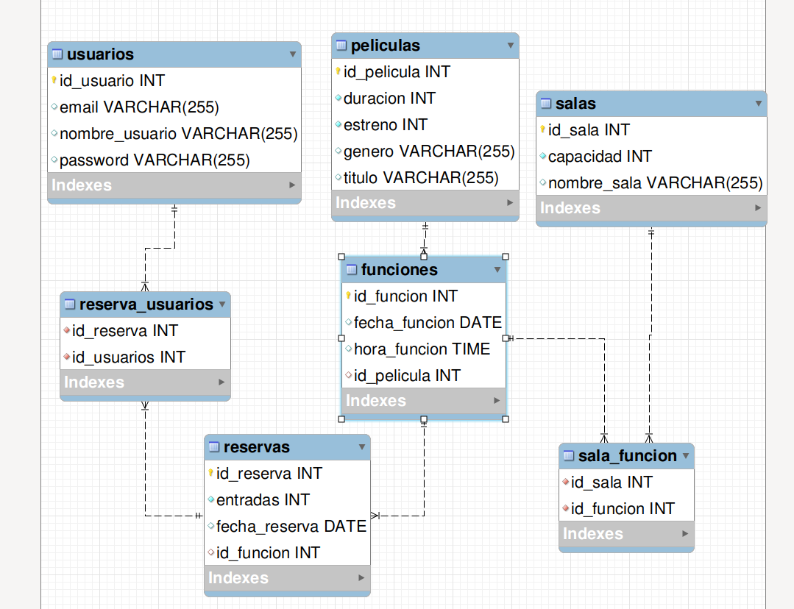

# CineMax RESTFul API

## Administración cine

Creación de REST Ful API o API REST backend con relaciones de entidades, 
base de datos Mysql.

El proyecto para administrar una sala de cine, con el registro de usuarios para 
el manejo de las reservas de las películas.  

[__Mockup CineMax PDF__](./devheroes-project/CINEMAX_MOCKUP.pdf)

## Relaciones de tablas

 

---

## Participantes

Grupo 8

## Administración de repositorio

mirrors

[__@Andy__](https://github.com/AndyOlguin/) | https://github.com/AndyOlguin/RestFul-Api-CineMax 

[__@Andr7st__](https://github.com/Andr7st/) | https://github.com/Andr7st/RestFulApi-CineMax 

